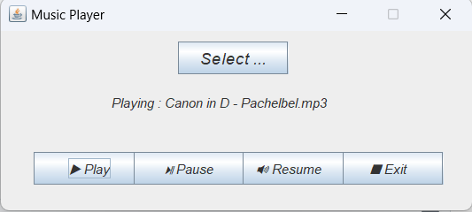

## SimpleMusicPlayer
Just a music player written in java using JFrame
# Features
At the Moment it only has
play,
pause,
resume and
select
as Features

# GUI
As the name says, its Simple

## Last words
I want to say, that this Project is the second Project ever written by me in Java and the first GUI-Application i made. 
Dont expect it to be that good.
Greets, YoungChopin
